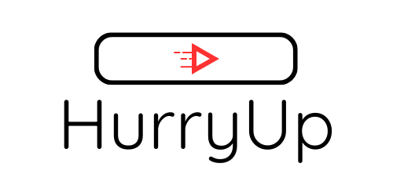

<p align="center">
  </img>
</p>
<h1 align="center">HurryUp</h1>

HurryUp is a small browser extension for displaying the actual duration of a video, taking into account the playback rate set by the user.

This extension is compatible with [SponsorBlock](https://github.com/ajayyy/SponsorBlock "SponsorBlock") which means that the calculated time will take into account the truncated sponsored part.


## Roadmap

These are the things I'd like to add to this extension in no particular order:

* [x] Add compatibility with [SponsorBlock](https://github.com/ajayyy/SponsorBlock "SponsorBlock") so that the time without sponsors is taken into account
* [ ] Add an option to display the calculated time on the thumbnail
  * [ ] Add a configuration for selected a prefered playback rate for thumbnails
* [ ] Add calculated current time in the video

If you think of a feature that would fit this project, don't hesitate to open an issue on github and I'll review it.

## Licence

```text
Copyright (C) 2025  Matthias Paulmier

This program is free software: you can redistribute it and/or modify
it under the terms of the GNU General Public License as published by
the Free Software Foundation, either version 3 of the License, or
(at your option) any later version.

This program is distributed in the hope that it will be useful,
but WITHOUT ANY WARRANTY; without even the implied warranty of
MERCHANTABILITY or FITNESS FOR A PARTICULAR PURPOSE.  See the
GNU General Public License for more details.

You should have received a copy of the GNU General Public License
along with this program.  If not, see <http://www.gnu.org/licenses/>
```
